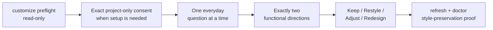

<p align="center">
  
</p>

<p align="center">
  <a href="https://silent-orbit-skills-library.netlify.app/">Live demo</a> ·
  <a href="./README.zh-CN.md">中文说明</a> ·
  <a href="https://github.com/Lucifer-St/silent-orbit-skills-library/actions/workflows/public-release-gate.yml">CI</a> ·
  <a href="./LICENSE">MIT code license</a>
</p>

Silent Orbit turns a growing AI Skills collection into a navigable product: search by intent, move from **System → Library → Skill**, inspect provenance and boundaries, and record outcomes without sending personal data to a backend.

The public catalog currently contains **153 Skills across 9 systems and 28 libraries**.

## The problem

AI Skills accumulate faster than people can understand or govern them. Names and folders alone do not answer the practical questions: **Which Skill fits this task? Where did it come from? What is safe to publish? Can I personalize the experience without changing my real Skills or losing the next data refresh?**

## What this beta delivers

Silent Orbit combines a local-first React product with a versioned Node.js toolkit:

- a bilingual, deterministic intent search and **System → Library → Skill** catalog;
- provenance and privacy boundaries before installation or trust;
- browser-local Outcomes with no account, analytics, or backend sync;
- deterministic Private-to-Public export with manifests, hashes, schema locks, and rollback evidence;
- five bundled Agent Skills: `build-skill-cosmos`, `audit-skill-cosmos`, `customize-skill-cosmos`, `manage-skill-cosmos`, and `skills-library-maintenance`.

## Engineering evidence

- **153 Skills · 28 Libraries · 9 systems · 36 active global Skills** in the governed catalog.
- **220+ automated tests and contract checks**, plus a **22-state** desktop/mobile visual QA matrix.
- Node.js 24 package smoke on **Windows, Linux, and macOS**, with a separate mounted/unmounted Docker contract.
- **React 19, TypeScript, Vite, Node.js 24, GitHub Actions, and Netlify** from interface through release.
- A single production path: Private source → deterministic Public Export → required GitHub check → Git-connected Netlify Production.

This is a GitHub **Pre-release**, not `v1.0.0`. Automated checks, author UAT, and Agent rehearsals are engineering evidence—not independent-human acceptance. The v1 gate stays open until a release-bound independent report passes with no unresolved P0/P1 findings.

## Customize your library

Install the release tarball locally as described in the [Generator Quickstart](./docs/guides/generator-quickstart.md), review the Skill, then add only the project-level customization layer:

```powershell
$skillSource = (Resolve-Path -LiteralPath .\node_modules\silent-orbit-skills-library).Path
Get-Content -LiteralPath (Join-Path $skillSource 'skills\customize-skill-cosmos\SKILL.md')
npx skills@1.5.20 add $skillSource --skill customize-skill-cosmos --agent codex --copy -y
```

Start with: **“Use `$customize-skill-cosmos`; begin with the read-only preflight, then ask me one everyday question at a time.”**



The workflow stores normalized summaries rather than raw interview answers, keeps previous rounds immutable, rejects CSS-only “redesigns,” and never installs, updates, or publishes real Skills.

## Start independent acceptance here

Send the tester only the
[`v0.13.1-beta.1` GitHub Pre-release](https://github.com/Lucifer-St/silent-orbit-skills-library/releases/tag/v0.13.1-beta.1).
They download `SILENT_ORBIT_NOVICE_HUMAN_TEST_PACK.zh-CN.md` from Assets, upload it to a
local Agent, and say `开始验收`. They do not fill templates, type the workflow
commands, or receive author-local files.

## Install the Public Generator

The Public Generator is distributed only as the verified GitHub Pre-release tarball; it is not published to the npm registry. Follow the [Generator Quickstart](./docs/guides/generator-quickstart.md) to verify the artifact, install the CLI from the downloaded file, optionally install the bundled project Skills, and complete a reviewed first generation. Independent v1 candidates should use the single [15–25 minute RC acceptance checklist](./docs/testing/v1-rc-acceptance.md). The same release contains `skills-library-maintenance` and `manage-skill-cosmos` for a backed-up, conflict-reviewed global handoff. Phase 5C supports one host-injected, reviewed `skills@1.5.20` check-and-update batch with private recovery, rescan, Library/Obsidian sync, and verification. The standalone CLI host remains empty; Plugin, System, deletion, freeze, and unknown-source mutation stay separately gated, and native update has no transaction guarantee.

## Capability boundary

- Native CLI and Generator support targets Node.js 24 on Windows, Linux, and
  macOS.
- Docker is supported only when the required host Skill directories are
  explicitly mounted. An unmounted container has its own empty Home and cannot
  inspect host Skills.
- The hosted site is browse-only. It cannot inspect, install, update, or remove
  Skills on a visitor's computer.
- Node.js 24 is the v1 runtime baseline. A different major version requires an
  explicit compatibility decision and gate update.

## Historical Phase 1E alpha evidence

The repository preserves a pinned **44-Skill Reference Preview** from Phase 1E as historical acceptance evidence. It is not built for current pull requests or Production; every Deploy Preview now uses the same current 153-Skill production build. The archived renderer demonstrated a white canvas, black relationship lines, category clusters, restrained pan/zoom, spatial focus transitions, and a compact Library view sharing search, filters, selection, and URL state.

This Reference Renderer is a functional starting point, not an official visual theme. Generated projects include `frontend-handoff.md` so users can retain the public data, keyboard behavior, deep links, and privacy boundary while rebuilding the interface with any visual style and frontend Skill they prefer.

- [Phase 1E architecture and acceptance boundary](./docs/notes/20260721-181423-generator-phase-1e-independent-alpha-reference-preview.md)
- [Phase 2B dogfood and source-of-truth boundary](./docs/notes/20260722-100249-generator-phase-2b-dogfooding-source-of-truth-boundary.md)
- [Install and first-use guide](./docs/guides/generator-quickstart.md)
- The Alpha receipt explicitly records `humanFeedback: false`; it proves a fixed independent environment, not external-user feedback.
- Production and Deploy Preview both use the reviewed 153-Skill site. The Alpha is historical acceptance evidence, not a second catalog source or Production replacement.

## See the library

<p align="center">
  
</p>

Start with a task, not a package name. Try **“Install and verify a new Codex Skill”** or **“安装并验证一个新的 Codex Skill”** in the live demo, then open the matching Skill to inspect when to use it, where it comes from, and what remains local.

<table>
  <tr>
    <td width="50%"></td>
    <td width="50%"></td>
  </tr>
  <tr>
    <td align="center"><sub>Browse by functional system</sub></td>
    <td align="center"><sub>Inspect source and usage boundaries</sub></td>
  </tr>
</table>

<p align="center">
  
</p>

## What it does

- **Searches bilingually by intent.** Chinese and English metadata share one deterministic local index.
- **Makes a large catalog legible.** The visual hierarchy separates functional systems, source libraries, and individual Skills.
- **Shows provenance before trust.** Public detail records distinguish creator showcases from third-party sources.
- **Keeps outcomes local.** Outcome records use the visitor's browser storage; the static app has no backend synchronization path.
- **Exports deterministically.** A strict allowlist, manifest, hashes, privacy checks, tests, browser smoke, and visual QA produce the public release candidate.

## How it works

<p align="center">
  
</p>

The Private development repository remains the authority for personal inventory, curation, Outcomes, usage evidence, Obsidian integration, and operating receipts. Public owns the versioned Core, Schemas, CLI, Agent Skill, Quickstarts, and reference renderer. Catalog files in this repository are deterministic sanitized projections, not a second authoring source; visitor outcomes never enter the export pipeline.

## Privacy boundary

- Only `public` and `creator-showcase` catalog records are published.
- Personal memory, local paths, accounts, sessions, usage evidence, private maintenance state, and knowledge-base content are excluded.
- Third-party Skill instruction files are not redistributed; the catalog carries factual metadata, source links, and project-curated summaries.
- Source maps and unapproved legacy visual candidates are rejected by the release validator.

`fengxue` and `fengxue-ai-weekly` remain intentionally visible as creator showcases. Their public records contain only public-facing identity, capability, invocation, and output descriptions.

## Run locally

Requirements: Node.js 24 and a Windows machine with Google Chrome for browser smoke and visual QA.

```powershell
npm ci
npm run dev
```

The development server runs locally. The production build is written to `dist/`.

## Public beta

- [Documentation index](./docs/README.md)
- [Beta testing guide](./docs/testing/beta-testing.md)
- [Beta feedback template](./docs/testing/beta-feedback-template.md)
- [V1 RC independent acceptance](./docs/testing/v1-rc-acceptance.md)
- [V1 RC acceptance (简体中文傻瓜版)](./docs/testing/v1-rc-acceptance.zh-CN.md)
- [V1 RC one-file Agent handoff (简体中文)](./docs/testing/v1-rc-one-file-handoff.zh-CN.md)
- GitHub issue forms are available for reproducible bugs and experience feedback.

The public beta uses no third-party analytics, cookies, or behavior tracking. Safari remains an external beta coverage item.

## Operational handoff

- [Installation and upgrade](./docs/guides/installation-and-upgrade.md)
- [Versioning, compatibility, migrations, and deprecation](./docs/policies/versioning-and-migrations.md)
- [Privacy policy and data boundary](./docs/policies/privacy.md)
- [Recovery and rollback](./docs/guides/recovery.md)
- [Security policy](./SECURITY.md)
- [Contribution policy](./CONTRIBUTING.md)

The `v0.11.0-beta.9` v1 Schemas are locked by
`schemas/schema-lock.v1.json`. This is a GitHub Pre-release, not `v1.0.0`, and
Production authority remains Public `main` after the required `release-gate`.

## Verify the release

```powershell
npm run validate:data
npm run validate:assets
npm run validate:public-repository
npm run validate:readme
npm run test:mvp
npx tsc --noEmit
npm run build
npm run build:alpha-preview
npm run smoke:ui
npm run qa:visual
```

GitHub Actions runs the same full gate on `windows-latest`. The manifest and privacy validator reject payload drift, private paths, secret-like material, untracked public assets, and prohibited source files.

## Limits and licensing

- This is a static discovery and outcome-tracking product, not an agent orchestrator or remote Skill runner.
- Browser-local outcomes do not sync across devices or origins.
- Application code is licensed under MIT.
- Project-created and project-generated visuals are excluded from MIT; see [`ASSET_LICENSE.md`](./ASSET_LICENSE.md).
- Fonts and dependencies retain their original licenses; see [`THIRD_PARTY_NOTICES.md`](./THIRD_PARTY_NOTICES.md) and [`ASSET_PROVENANCE.json`](./ASSET_PROVENANCE.json).

Security reports, privacy, recovery, versioning, and contribution boundaries
are documented in the operational handoff above.
