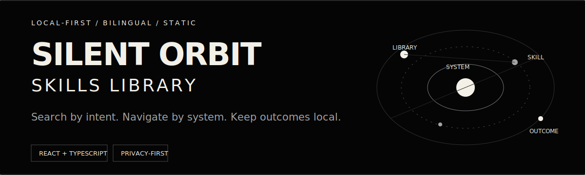
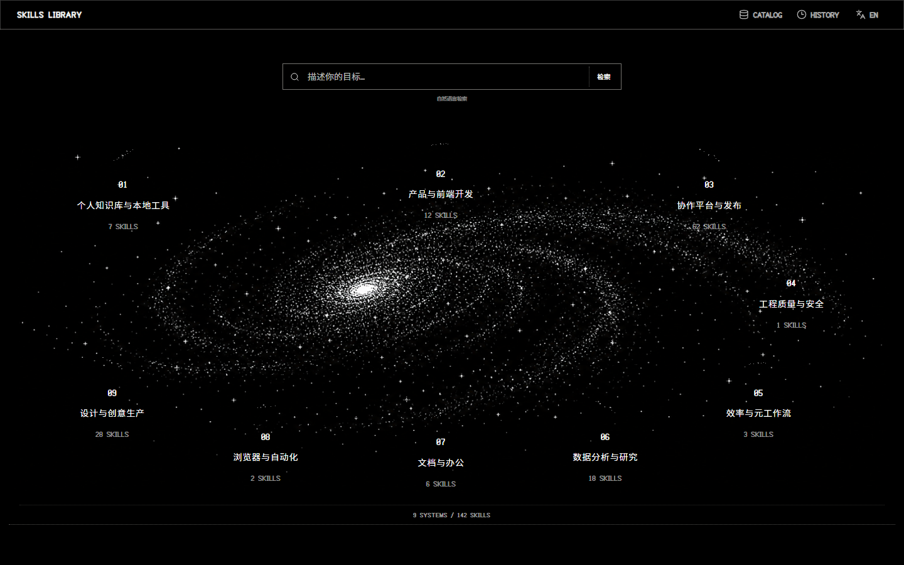
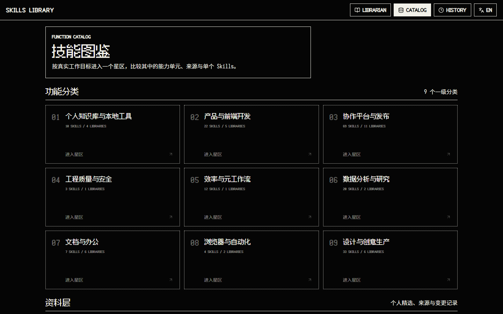
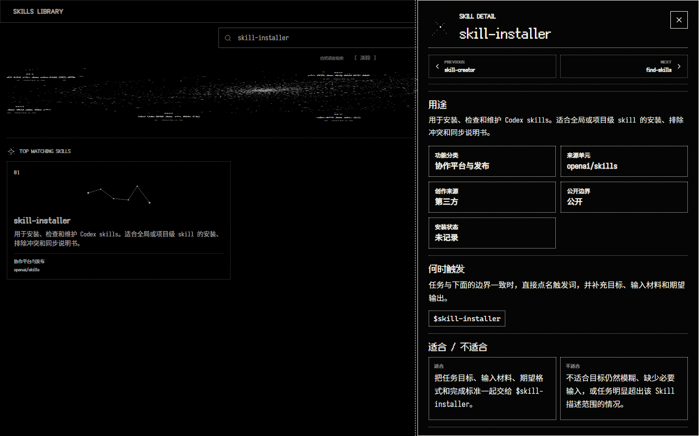
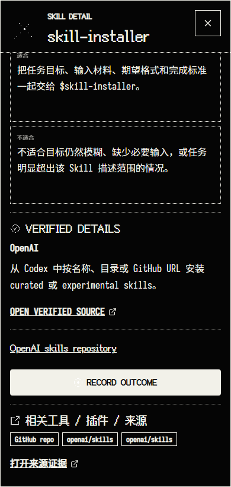
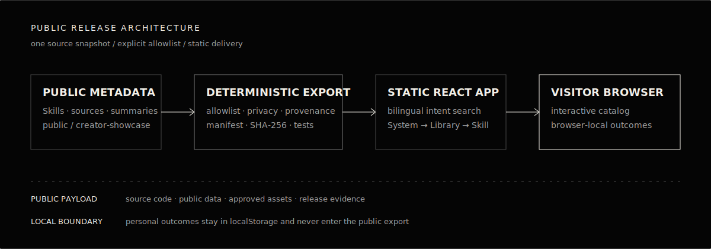

<p align="center">
  
</p>

<p align="center">
  <a href="https://silent-orbit-skills-library.netlify.app/">在线体验</a> ·
  <a href="./README.md">English</a> ·
  <a href="https://github.com/Lucifer-St/silent-orbit-skills-library/actions/workflows/public-release-gate.yml">CI</a> ·
  <a href="./LICENSE">MIT 代码许可证</a>
</p>

Silent Orbit 把不断增长的 AI Skills 集合变成一个可以使用的产品：按意图搜索，沿着 **System → Library → Skill** 探索，核对来源与公开边界，并在不把个人数据发送到后端的前提下记录成果。

当前公开目录包含 **142 个 Skills、9 个功能系统和 28 个 Libraries**。

## 先看真实产品

<p align="center">
  
</p>

从任务开始，而不是先记包名。可在在线 Demo 中输入 **“安装并验证一个新的 Codex Skill”** 或 **“Install and verify a new Codex Skill”**，再打开匹配结果，检查它何时适用、来自哪里，以及哪些数据仍然只留在本地。

<table>
  <tr>
    <td width="50%"></td>
    <td width="50%"></td>
  </tr>
  <tr>
    <td align="center"><sub>按功能系统浏览</sub></td>
    <td align="center"><sub>核对来源与使用边界</sub></td>
  </tr>
</table>

<p align="center">
  
</p>

## 它解决什么问题

- **按意图进行双语搜索。** 中英文元数据进入同一个确定性本地索引。
- **让大型目录变得可理解。** 功能系统、来源 Library 和单个 Skill 拥有清楚的层级。
- **先呈现来源，再要求信任。** 公开详情会区分作者自建案例与第三方来源。
- **Outcome 只留在浏览器。** 静态应用没有后端同步路径。
- **公开版本可以重复生成。** Allowlist、manifest、hash、隐私门禁、测试、浏览器 smoke 和视觉 QA 共同构成发布证据。

## 工作方式

<p align="center">
  
</p>

Private 开发仓库继续作为事实源。这个公开仓库只从明确的公开 allowlist 生成，并使用全新的干净 Git 历史。公开元数据经过确定性 exporter 进入静态 React 应用；访客 Outcome 不会进入这条导出链路。

## 隐私边界

- 只发布 `public` 与 `creator-showcase` 记录。
- 私人记忆、本机路径、账号、session、使用证据、私人维护状态和知识库内容不会进入发布包。
- 不重新分发第三方 Skill 指令全文，只保留事实性元数据、来源链接和项目策展的简短摘要。
- Release validator 会拒绝 source map、私人路径、秘密材料和未批准的 legacy 候选素材。

`fengxue` 与 `fengxue-ai-weekly` 有意保留为作者自建案例，但只包含公开身份、能力、触发方式与输出说明。

## 本地运行

要求：Node.js 24；浏览器 Smoke 与视觉 QA 当前需要安装 Google Chrome 的 Windows 环境。

```powershell
npm ci
npm run dev
```

生产构建输出到 `dist/`。

## Public Beta

- [Beta 测试任务](./BETA_TESTING.md)
- [Beta 反馈模板](./BETA_FEEDBACK_TEMPLATE.md)
- GitHub 已提供可复现 Bug 与体验反馈的 Issue Forms。

Public Beta 不使用第三方 analytics、cookies 或行为追踪；Safari 仍是外部 Beta 覆盖项。

## 验证发布包

```powershell
npm run validate:data
npm run validate:assets
npm run validate:public-repository
npm run validate:readme
npm run test:mvp
npx tsc --noEmit
npm run build
npm run smoke:ui
npm run qa:visual
```

GitHub Actions 会在 `windows-latest` 执行同一套完整门禁。Manifest 与隐私 validator 会拒绝 payload 漂移、私人路径、疑似 secret、未登记公开资产和禁止文件。

## 限制与授权

- 它是静态 Skills 发现与 Outcome 记录产品，不是 Agent 编排器或远程 Skill 执行器。
- 浏览器本地 Outcome 不会跨设备或不同域名自动同步。
- 应用代码采用 MIT License。
- 项目自制或项目生成的视觉资产不包含在 MIT 内；见 [`ASSET_LICENSE.md`](./ASSET_LICENSE.md)。
- 字体与依赖保留其原许可证；见 [`THIRD_PARTY_NOTICES.md`](./THIRD_PARTY_NOTICES.md) 与 [`ASSET_PROVENANCE.json`](./ASSET_PROVENANCE.json)。

安全报告与贡献边界见 [`SECURITY.md`](./SECURITY.md) 和 [`CONTRIBUTING.md`](./CONTRIBUTING.md)。
