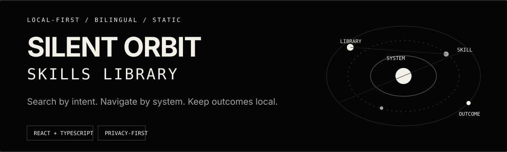
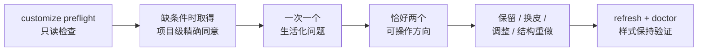
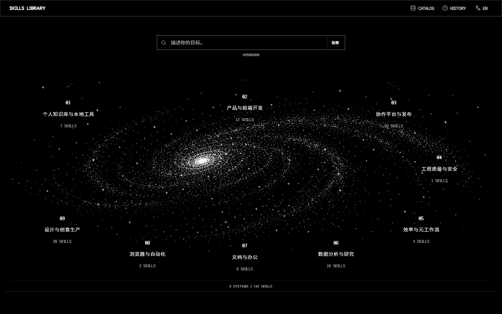
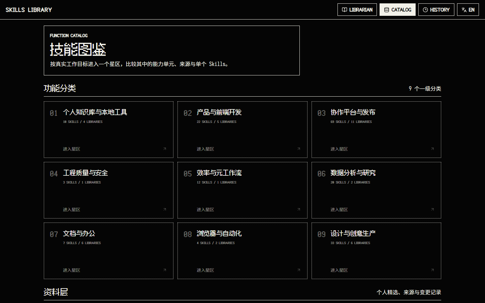
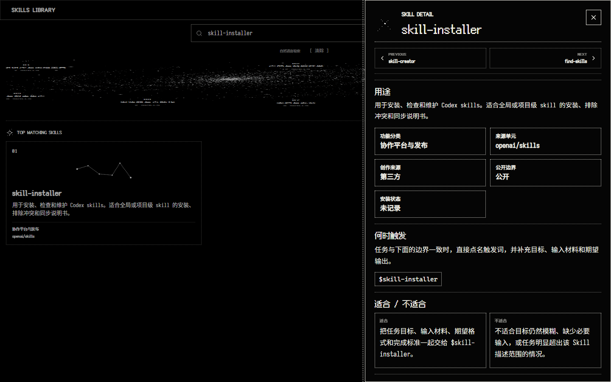
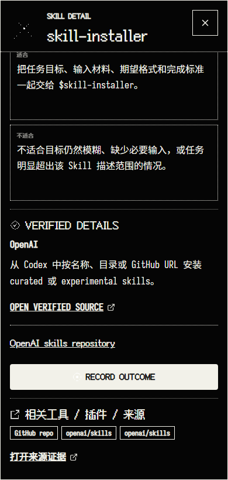
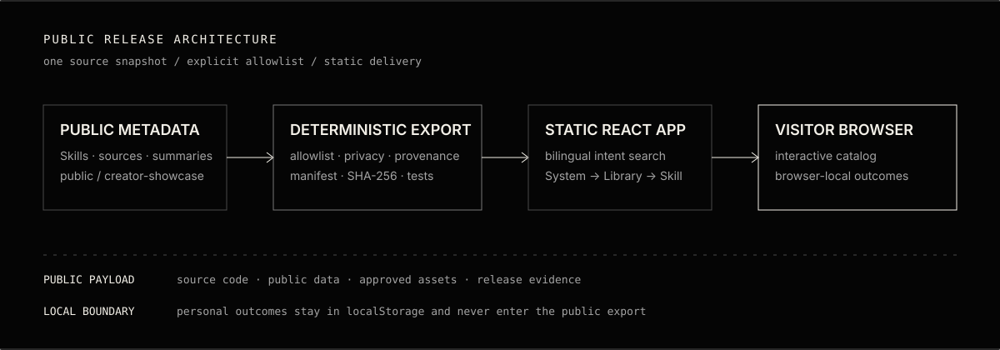

<p align="center">
  
</p>

<p align="center">
  <a href="https://silent-orbit-skills-library.netlify.app/">在线体验</a> ·
  <a href="./README.md">English</a> ·
  <a href="https://github.com/Lucifer-St/silent-orbit-skills-library/actions/workflows/public-release-gate.yml">CI</a> ·
  <a href="./LICENSE">MIT 代码许可证</a>
</p>

Silent Orbit 把不断增长的 AI Skills 集合变成一个可以使用的产品：按意图搜索，沿着 **System → Library → Skill** 探索，核对来源与公开边界，并在不把个人数据发送到后端的前提下记录成果。

当前公开目录包含 **153 个 Skills、9 个功能系统和 28 个 Libraries**。

## 它解决的问题

AI Skills 的增长速度往往快于人理解和治理它们的速度。只有名称和文件夹，无法回答真正影响使用的问题：**当前任务该选哪个 Skill？它来自哪里？哪些内容可以公开？能否在不修改真实 Skills、也不丢失下一次数据刷新的前提下完成个性化？**

## 这个 Beta 交付了什么

Silent Orbit 把一个本地优先的 React 产品与版本化 Node.js 工具链组合在一起：

- 确定性的双语意图搜索与 **System → Library → Skill** 目录；
- 在安装或信任前呈现来源、权限和隐私边界；
- 无账号、无 analytics、无后端同步的浏览器本地 Outcomes；
- 带 manifest、hash、schema lock 与回滚证据的确定性 Private-to-Public 导出；
- 五个随包 Agent Skills：`build-skill-cosmos`、`audit-skill-cosmos`、`customize-skill-cosmos`、`manage-skill-cosmos`、`skills-library-maintenance`。

## 工程证据

- 受治理目录包含 **153 Skills · 28 Libraries · 9 个功能系统 · 36 个 active global Skills**。
- **220+ 项自动化测试与合同检查**，以及覆盖桌面与移动端的 **22-state** 视觉 QA 矩阵。
- Node.js 24 package smoke 覆盖 **Windows、Linux、macOS**，并单独验证 Docker 挂载与未挂载边界。
- 技术栈为 **React 19、TypeScript、Vite、Node.js 24、GitHub Actions、Netlify**。
- 唯一生产链为：Private source → deterministic Public Export → GitHub required check → Git-connected Netlify Production。

当前仍是 GitHub **Pre-release**，不是 `v1.0.0`。自动化检查、作者 UAT 与 Agent 演练属于工程证据，不等于独立真人验收；只有与 Release 正确绑定、且没有未解决 P0/P1 的独立报告才能关闭 v1 human gate。

## 定制自己的 Skills Library

先按 [Generator 快速开始](./docs/guides/generator-quickstart.zh-CN.md) 在项目中安装 Release tarball，审阅 Skill，再只添加项目级个性化层：

```powershell
$skillSource = (Resolve-Path -LiteralPath .\node_modules\silent-orbit-skills-library).Path
Get-Content -LiteralPath (Join-Path $skillSource 'skills\customize-skill-cosmos\SKILL.md')
npx skills@1.5.20 add $skillSource --skill customize-skill-cosmos --agent codex --copy -y
```

入口提示词：**“使用 `$customize-skill-cosmos`；先做只读预检，然后一次只问我一个生活化问题。”**


```mermaid
flowchart LR
  A["customize preflight<br/>只读检查"] --> B["缺条件时取得<br/>项目级精确同意"]
  B --> C["一次一个<br/>生活化问题"]
  C --> D["恰好两个<br/>可操作方向"]
  D --> E["保留 / 换皮 /<br/>调整 / 结构重做"]
  E --> F["refresh + doctor<br/>样式保持验证"]
```

流程只保存归一化摘要而不是原始访谈答案；旧 rounds 保持不可变，CSS-only 的“结构重做”会被拒绝，也不会安装、更新或发布真实 Skills。

## 真人验收从这里开始

只把 [`v0.13.1-beta.1` GitHub Pre-release](https://github.com/Lucifer-St/silent-orbit-skills-library/releases/tag/v0.13.1-beta.1)
这一个链接发给验收者。验收者在 Assets 下载
`SILENT_ORBIT_NOVICE_HUMAN_TEST_PACK.zh-CN.md`，上传给本机 Agent，然后说
`开始验收`；不需要自己输入命令、填写模板或接收作者本地文件。

## 安装 Public Generator

Public Generator 只通过已验证的 GitHub Pre-release tarball 分发，不发布到 npm registry。请按 [Generator 快速开始](./docs/guides/generator-quickstart.zh-CN.md) 校验产物，从已下载文件进行项目级或全局 CLI 安装；独立 v1 候选验收统一使用上面的 Release 单文件入口，详细中文合同见 [15–25 分钟中文傻瓜验收](./docs/testing/v1-rc-acceptance.zh-CN.md)，英文原始合同仍见[英文清单](./docs/testing/v1-rc-acceptance.md)。如有需要，再以项目级方式安装随包提供的 `build-skill-cosmos`、`audit-skill-cosmos` 与 `manage-skill-cosmos` Agent Skill，并完成一次经过公开边界复核的首次生成。Phase 5C 支持 host 注入的 `skills@1.5.20` reviewed check-and-update 批次，并要求私有恢复、rescan、Library/Obsidian sync 与验证。standalone host 仍为空；Plugin、System、删除与未知来源 mutation 保持单独门禁，原生 update 没有 native transaction guarantee。

## 能力边界

- Native CLI 与 Generator 以 Windows、Linux、macOS 上的 Node.js 24 为支持目标。
- Docker 只有在显式挂载所需宿主 Skills 目录时才受支持。未挂载的容器拥有独立的空 Home，无法读取宿主 Skills。
- Hosted 站点只用于浏览，不能检查、安装、更新或删除访客电脑上的 Skills。
- Node.js 24 是 v1 运行时基线；改变 major version 必须重新做兼容决策并更新门禁。

## 历史 Phase 1E Alpha 证据

仓库保留一份来自 Phase 1E 固定独立环境的 **44-Skill Reference Preview**，仅作为历史验收证据。当前 PR 与 Production 都不会再构建它；每个 Deploy Preview 都使用与 Production 相同的 153-Skill 当前构建。归档 renderer 曾验证白底、黑色关系线、Category 聚类、克制的平移缩放、空间聚焦动画，以及与地图共享搜索、筛选、选中项和 URL 状态的紧凑 Library 视图。

Reference Renderer 只是可用的功能底稿，不是官方美术主题。生成项目会包含 `frontend-handoff.md`，用户可以保留公开数据、键盘交互、深链和隐私边界，同时使用自己喜欢的视觉风格与 frontend Skill 重做界面。

- [Phase 1E 架构与验收边界](./docs/notes/20260721-181423-generator-phase-1e-independent-alpha-reference-preview.md)
- [Phase 2B dogfood 与 source-of-truth boundary](./docs/notes/20260722-100249-generator-phase-2b-dogfooding-source-of-truth-boundary.md)
- [安装与首次使用指南](./docs/guides/generator-quickstart.zh-CN.md)
- Alpha receipt 明确记录 `humanFeedback: false`；它证明固定独立环境，而不冒充真实外部用户反馈。
- Production 与 Deploy Preview 都使用经复核的 153-Skill 站点。Alpha 只是历史 acceptance evidence，不是第二个 catalog source，也不替代 Production。

## 先看真实产品

<p align="center">
  
</p>

从任务开始，而不是先记包名。可在在线 Demo 中输入 **“安装并验证一个新的 Codex Skill”** 或 **“Install and verify a new Codex Skill”**，再打开匹配结果，检查它何时适用、来自哪里，以及哪些数据仍然只留在本地。

<table>
  <tr>
    <td width="50%"></td>
    <td width="50%"></td>
  </tr>
  <tr>
    <td align="center"><sub>按功能系统浏览</sub></td>
    <td align="center"><sub>核对来源与使用边界</sub></td>
  </tr>
</table>

<p align="center">
  
</p>

## 它解决什么问题

- **按意图进行双语搜索。** 中英文元数据进入同一个确定性本地索引。
- **让大型目录变得可理解。** 功能系统、来源 Library 和单个 Skill 拥有清楚的层级。
- **先呈现来源，再要求信任。** 公开详情会区分作者自建案例与第三方来源。
- **Outcome 只留在浏览器。** 静态应用没有后端同步路径。
- **公开版本可以重复生成。** Allowlist、manifest、hash、隐私门禁、测试、浏览器 smoke 和视觉 QA 共同构成发布证据。

## 工作方式

<p align="center">
  
</p>

Private 开发仓库保存个人 inventory、curation、Outcomes、usage evidence、Obsidian integration 与运行 receipts。Public 保存 versioned Core、Schemas、CLI、Agent Skill、Quickstarts 与 reference renderer。Public catalog 文件是 deterministic sanitized projection，不是第二个可编辑来源；访客 Outcome 不会进入 export pipeline。

## 隐私边界

- 只发布 `public` 与 `creator-showcase` 记录。
- 私人记忆、本机路径、账号、session、使用证据、私人维护状态和知识库内容不会进入发布包。
- 不重新分发第三方 Skill 指令全文，只保留事实性元数据、来源链接和项目策展的简短摘要。
- Release validator 会拒绝 source map、私人路径、秘密材料和未批准的 legacy 候选素材。

`fengxue` 与 `fengxue-ai-weekly` 有意保留为作者自建案例，但只包含公开身份、能力、触发方式与输出说明。

## 本地运行

要求：Node.js 24；浏览器 Smoke 与视觉 QA 当前需要安装 Google Chrome 的 Windows 环境。

```powershell
npm ci
npm run dev
```

生产构建输出到 `dist/`。

## Public Beta

- [文档索引](./docs/README.md)
- [Beta 测试任务](./docs/testing/beta-testing.md)
- [Beta 反馈模板](./docs/testing/beta-feedback-template.md)
- [V1 RC 中文傻瓜验收](./docs/testing/v1-rc-acceptance.zh-CN.md)
- [直接发给验收者的单文件 Agent 交接包](./docs/testing/v1-rc-one-file-handoff.zh-CN.md)
- [V1 RC 英文原始验收合同](./docs/testing/v1-rc-acceptance.md)
- GitHub 已提供可复现 Bug 与体验反馈的 Issue Forms。

Public Beta 不使用第三方 analytics、cookies 或行为追踪；Safari 仍是外部 Beta 覆盖项。

## 安装与运行交接

- [安装与升级](./docs/guides/installation-and-upgrade.zh-CN.md)
- [版本、兼容、迁移与弃用政策](./docs/policies/versioning-and-migrations.zh-CN.md)
- [隐私政策与数据边界](./docs/policies/privacy.zh-CN.md)
- [恢复与回滚](./docs/guides/recovery.zh-CN.md)
- [Security policy](./SECURITY.md)
- [贡献政策](./CONTRIBUTING.md)

`v0.11.0-beta.9` 的 v1 Schemas 由 `schemas/schema-lock.v1.json` 固定。
这是 GitHub Pre-release，不是 `v1.0.0`；Production authority 仍是通过必需
`release-gate` 的 Public `main`。

## 验证发布包

```powershell
npm run validate:data
npm run validate:assets
npm run validate:public-repository
npm run validate:readme
npm run test:mvp
npx tsc --noEmit
npm run build
npm run build:alpha-preview
npm run smoke:ui
npm run qa:visual
```

GitHub Actions 会在 `windows-latest` 执行同一套完整门禁。Manifest 与隐私 validator 会拒绝 payload 漂移、私人路径、疑似 secret、未登记公开资产和禁止文件。

## 限制与授权

- 它是静态 Skills 发现与 Outcome 记录产品，不是 Agent 编排器或远程 Skill 执行器。
- 浏览器本地 Outcome 不会跨设备或不同域名自动同步。
- 应用代码采用 MIT License。
- 项目自制或项目生成的视觉资产不包含在 MIT 内；见 [`ASSET_LICENSE.md`](./ASSET_LICENSE.md)。
- 字体与依赖保留其原许可证；见 [`THIRD_PARTY_NOTICES.md`](./THIRD_PARTY_NOTICES.md) 与 [`ASSET_PROVENANCE.json`](./ASSET_PROVENANCE.json)。

安全报告与贡献边界见 [`SECURITY.md`](./SECURITY.md) 和 [`CONTRIBUTING.md`](./CONTRIBUTING.md)。
